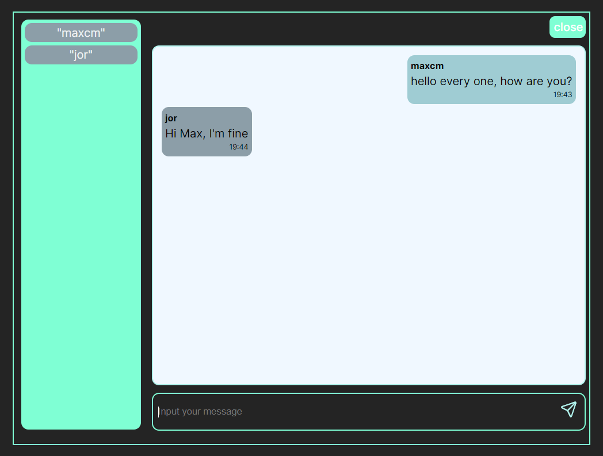

# Chat Application FullStack 

this is an small fullstack application for get knoladge about WebSockets and how that function, in this application you can review some functionalities since connect to chat, subscribe to a route, send message inside public chat group, disconnect, get list active users. and also how confifure websocket in a Service creatting endpoints to join to a Public Chat.

## Backend (/socket-service)
* maven
* Spring Boot
* jdk 17
* spring-boot-starter-websocket

### Start Server 
* mvn spring-boot:run
## Frontend (/chat-client)
* React
* TypeScript
* Vite
* SockJS-client
* StompJS
* @types/sockjs-client
* @types/stompjs

### Start Client
* yarn 
* yarn dev

or 
* npm install
* npm run dev

