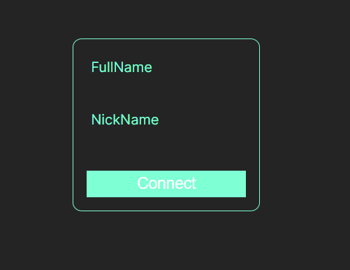
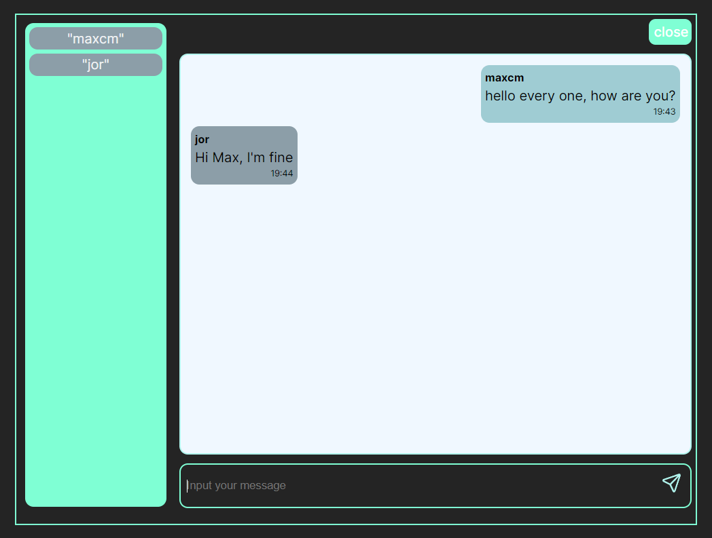

# Chat Client Application POC

* By: maxcmartinez

Is an POC chat application using sockjs-client and stompjs library. this application consumes from socket server endpoints where we start a public chat where every user can send and receive messages.

## Technologies
* React
* TypeScript
* vite
* SockJS-client
* StompJS
* @types/sockjs-client
* @types/stompjs

## Documentation
* http://jmesnil.net/stomp-websocket/doc/

